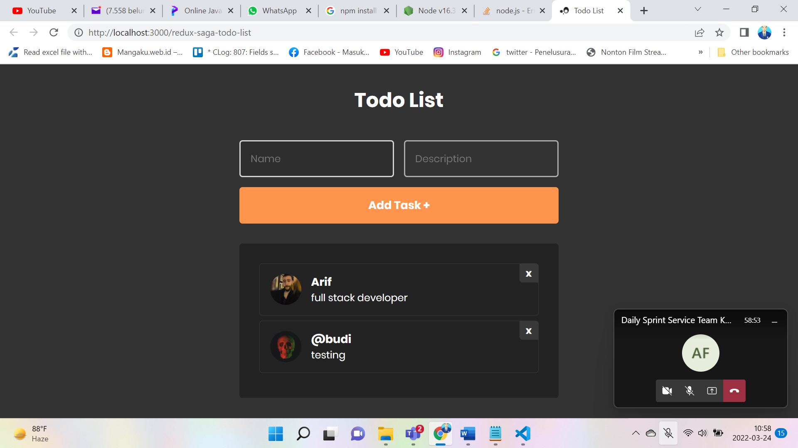

<h1 style="text-align: center">
  
  <span style="margin-left: 16px">Redux Saga Todo List</span>
</h1>

<p style="text-align: center">
  

  

  

  

   <a href="https://github.com/luanedcosta/redux-saga-todo-list/commits/master">
    
  </a>

  <a href="https://github.com/luanedcosta/redux-saga-todo-list/issues">
    
  </a>
</p>

<div style="text-align: center">
    
</div>

---


## :rocket: Technologies

- [React](https://reactjs.org/)
- [Redux](https://redux.js.org/)
- [Redux-Saga](https://redux-saga.js.org/)
- [Styled Components](https://www.styled-components.com/)
- [Axios](https://github.com/axios/axios)

## :information_source: How To Use

To clone and run this application, you'll need [Git](https://git-scm.com), [Node.js][nodejs] + [Yarn][yarn] installed on your computer.

From your command line:

```bash
# Clone this repository
$ git clone https://github.com/ariffebriyanto/REKAVA.git

# Go into the repository
$ cd redux-saga-todo-list

# Install dependencies
$ yarn install

# Run the app
$ yarn start
```

## :man: Author

Made with ♥ by Arif Febriyanto | [Follow me on Linkedin](https://www.linkedin.com/in/arif-febriyanto-30232089/)

[nodejs]: https://nodejs.org/
[yarn]: https://yarnpkg.com/
[vc]: https://code.visualstudio.com/
